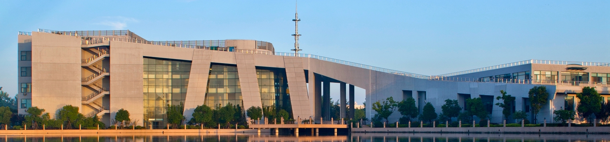

------------------------------------------------------------------------

## News

::: callout-important

**\[2025/09/25\]**

Today's class will continue our exploration of GIS focusing on Nighttime Light Data Analysis. I will guide you through practical applications of GIS using NASA night light data. You can find the lecture slides and lab materials on the [Schedule page](/schedule/schedule.html). Last but not least,[**Please bring your laptops to class!**]{style="color: orange;"}
:::


**\[2025/09/17\]** Tomorrow's class will be divided into two parts.The first hour will focus on GIS fundamentals, covering essential concepts and principles of Geographic Information Systems. In the second hour lab session, our TA, Xiaotian will introduce basic GIS operations in R, teaching you how to work with spatial data and perform geospatial analysis using R. You can find the lecture slides and lab materials on the [Schedule page](/schedule/schedule.html).Last but not least,[**don't forget bringing your laptops to class!**]{style="color: red;"}

**\[2025/09/11\]** I will introduce Basic R and Data manage skills using Rmarkdown. And in the lab session, our TA, Xiaotian will continue to work git and GitHub, which are essential tools for version control and collaboration in data science projects. [**Please make sure to bring your laptops to class!**]{style="color: blue;"}

**\[2025/09/4\]** Tomorrow I will introduce the basics of Git and GitHub, which are essential tools for version control and collaboration in data science projects. In the lab sessionm, our TA will teach you these baic tools from installing to using them in your projects.[**Please make sure to bring your laptops to class!**]{style="color: pink;"}

**\[2025/08/27\]** Welcome to the course! Tomorrow will be the first lecture. I will introduce some the data sciene and AI for economists, and also go over the syllabus and course structure and other logistics you might want to know about. You can find the lecture slides and the course syllabus on the course website. Looking forward to seeing you all in class!

**\[2025/06/30\]** Welcome to the course! This course is designed to introduce you to the exciting world of data science and artificial intelligence, specifically tailored for economists. We will explore various tools and techniques that will enhance your research capabilities in the digital age.

------------------------------------------------------------------------

## Course Description

::: {style="text-align: justify;"}
This course introduces students to the foundational concepts of data science and artificial intelligence, emphasizing their practical applications in economics and social sciences. Topics covered include spatial data analysis, web scraping and text analysis, OCR and text recognition, and machine learning techniques. Unlike traditional econometrics courses, the focus is on using real-world examples and hands-on projects to develop students' ability to work with non-traditional economic data.

The course prioritizes practical skills and intuition over theoretical or mathematical rigor, allowing students to gain experience with modern data science tools without being overwhelmed by complex equations. The goal is to equip students with the skills needed to apply data science and AI methods in their research and critically assess empirical studies that utilize these techniques.

Specifically, students will learn how to use various data science and AI tools to analyze non-traditional data sources and make reliable predictions about economic and social relationships. This course is designed to help students become more competitive in the field of economic research in the digital age.
:::

------------------------------------------------------------------------

```{r, out.width = "1200px", echo=FALSE, fig.align='center'}

```